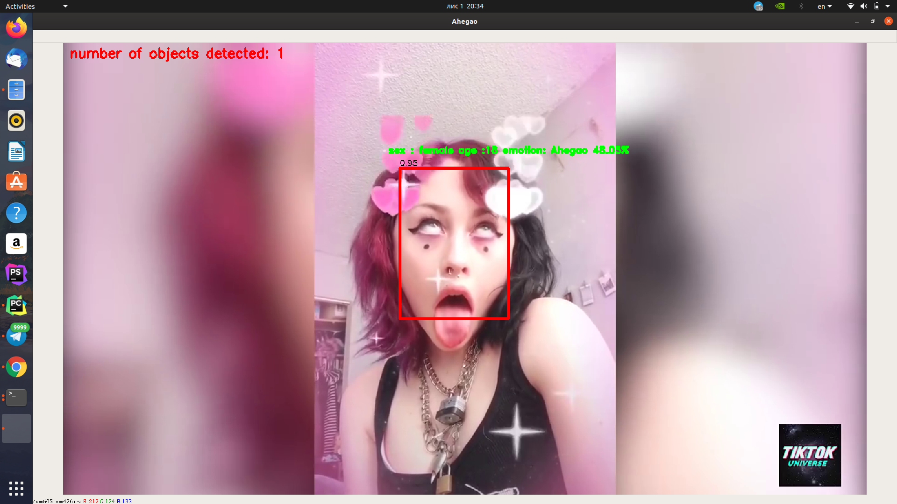
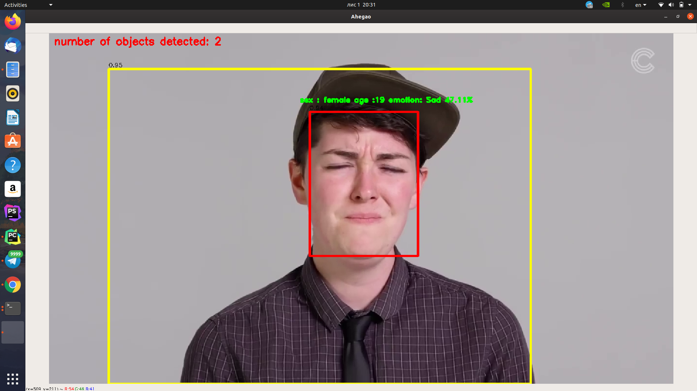

**OAHEGA TRACKER**
https://drive.google.com/open?id=1Wj57j0lJk1x1_8zRBpbmXMW2mCm0FTJb - load model for yolo object detection (not necessary)

Put both models into the directory and run the command : <pre>python run.py</pre> 
In order to switch from tensorflowmodel back to yolo run : <pre>python run.pu --type_model=''</pre>
For tensorflow (default) model it's recommended to use threshold_conf of 0.5, the one can easily change it by running the following command : <pre>python run.py --threshold_conf=0.5</pre>

Added new logic for face rotation, described here : https://medium.com/@urumipainblackreaper/precise-face-alignment-with-opencv-dlib-e6c8acead262
Examples of usage :

  
 

