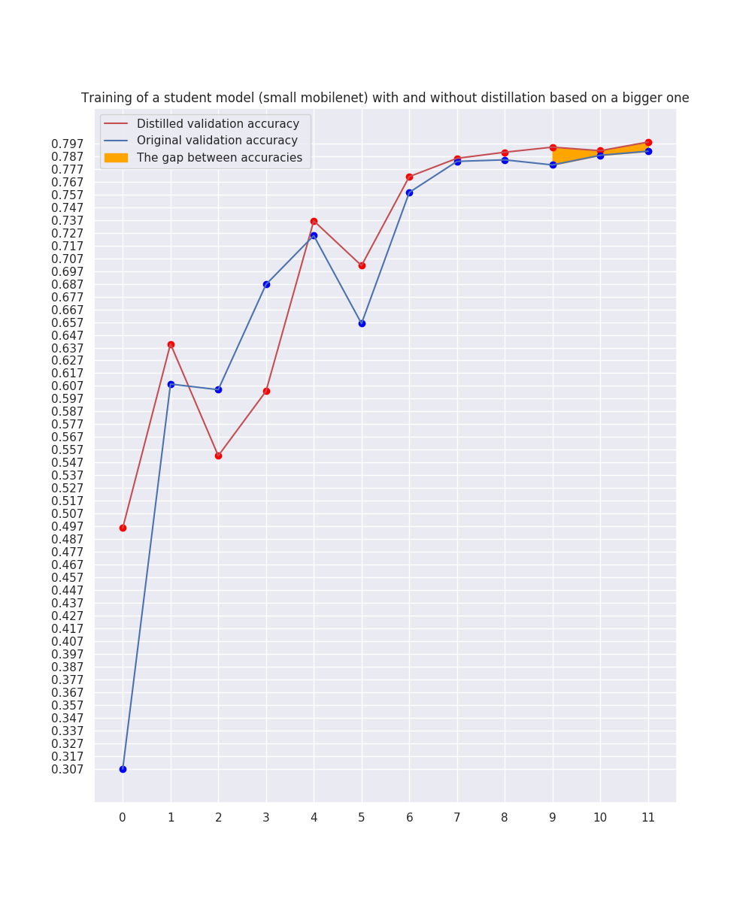
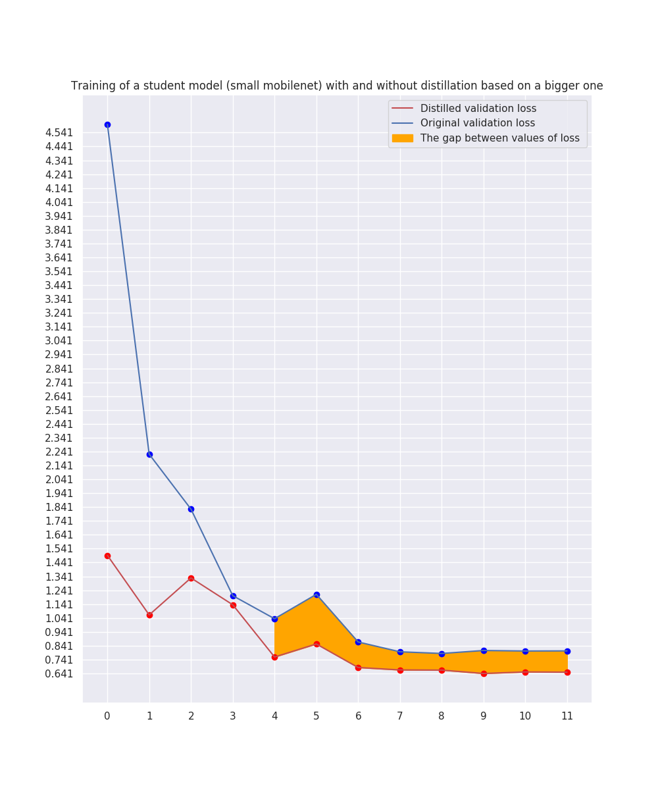

**DISTILLATION PROCESS**

Distillation process for OAHEGA dataset based on this repo : <a href=https://github.com/johnkorn/distillation>this</a>.
The main aim of conducting distillation is to transfer the knowledge from the bigger model to the smaller one in order to then apply it on mobile devices. The model used as a student is a mobilenet with an alpha of 0.25, pretreined imagenet weights and dense layer with 512 nodes + kernel regularization (more details can be found in the code itself). The conducted experiment showed that using the distillation the gap in accuracy between ordinar model and model trained with distillation is approximately 1%. The charts showing training process are represented below :

  

