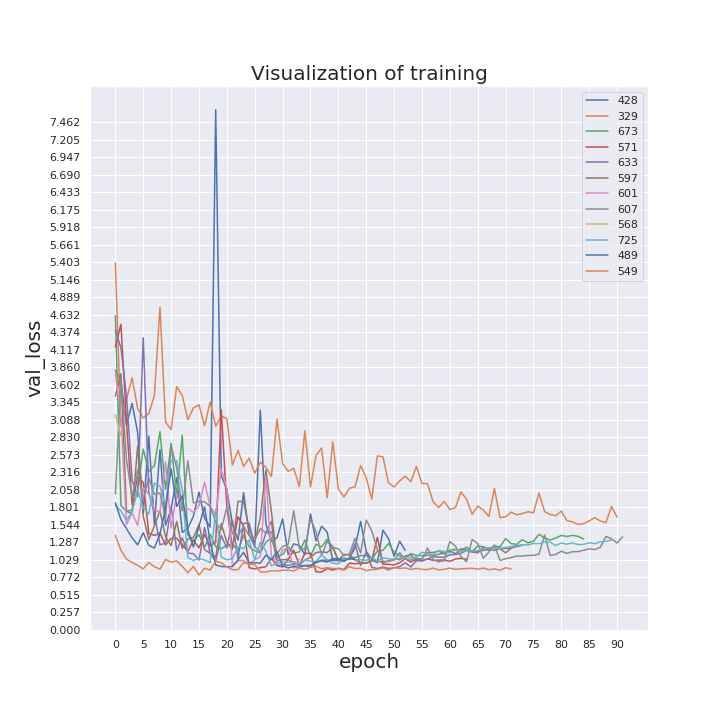
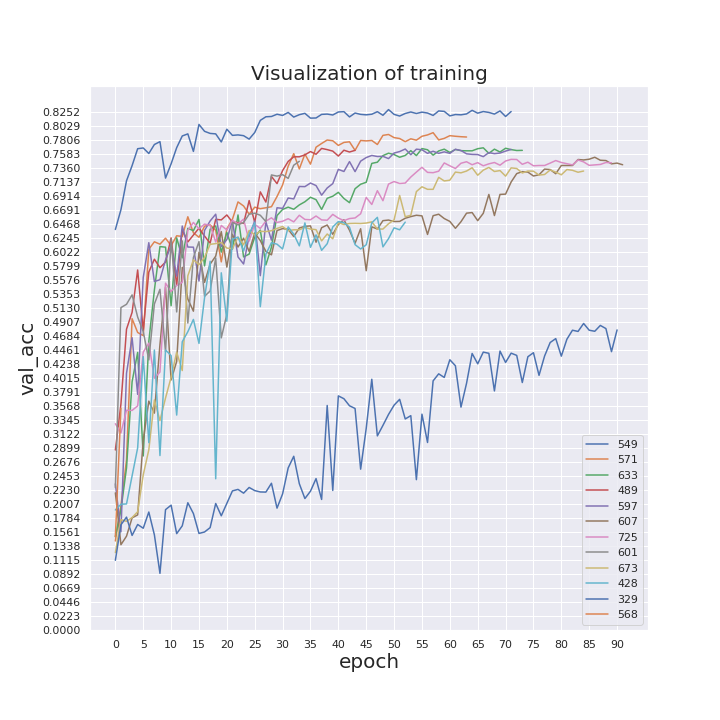
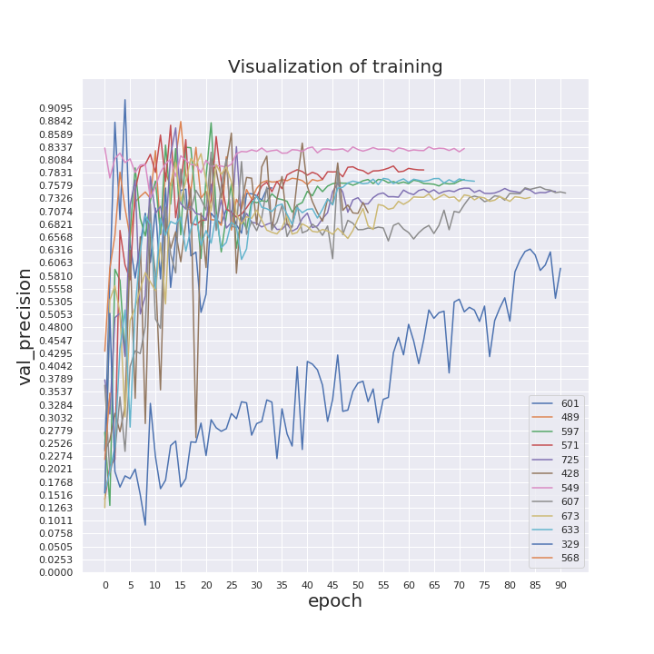
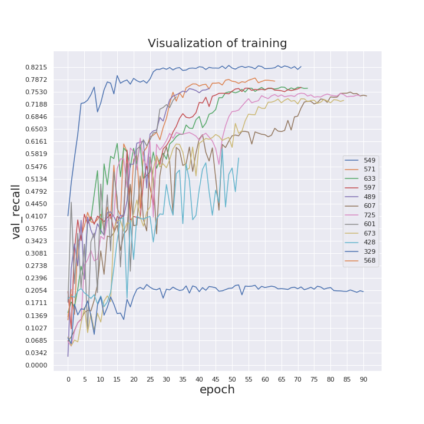
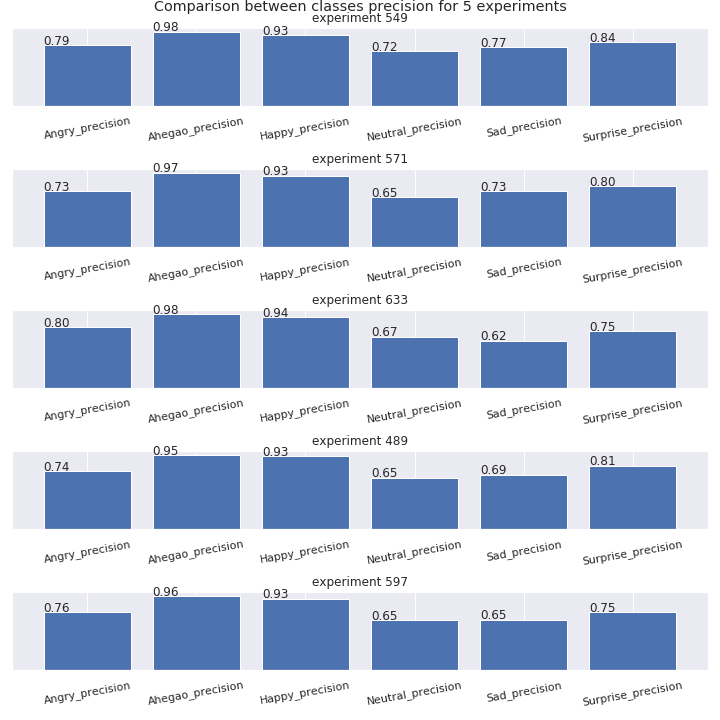

**MOBILENET EMOTIONS**

To start trainig :
1. virualenv env
2. go to the folder of a project
3. pip install -r req.txt
4. download dataset from the link below:

https://drive.google.com/open?id=1gvTl8qubBPI24cXW2noEH-Al5PnrcURL

5. change settings.py 
6. To train net with forest minimize: 
<pre>python main.py define_params_nn</pre> 
7. To train model with best params:
<pre>python main.py train_net</pre> 
8. To get familiar with the whole functionality:
<pre>python main.py -h</pre> 

In order to find the best teacher model to distill its knowledge to a portable student model we conduct the process of defining best hyper parameters using forest minimize on top of training the model. We then visualize the training logs and based on different metrics decide which model is the best one. The charts showing training process are represented below.

  

  

  

  

  
 After the charts are analysed the best model is picked as a teacher one and the process of distillation is conducted.
